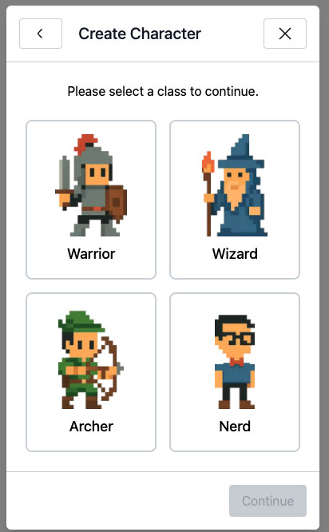

# Rated the world's #1 xState based RPG character generator!

Don't stay up all night making awesome RPG characters.  There's always tomorrow.



### To run

- pnpm install
- pnpm run dev

### To test

- pnpm run test

### GitHub Pages Deployment

This project builds to the `dist/` directory. While GitHub Pages natively supports the root or `/docs` folder *on your main branch*, it also allows you to deploy from **any branch**.

By using the `dist/` folder and a separate `gh-pages` branch, you keep your `main` branch clean and reserve the `docs/` folder for actual documentation (KDoc, API docs, etc.) in the future.

#### How to deploy:

1.  **Build the project**:
    ```bash
    pnpm run build
    ```
2.  **Deploy to `gh-pages`**:
    Simply run the deploy script:
    ```bash
    pnpm run deploy
    ```
    *(This will build the project and push the `dist` folder to a `gh-pages` branch automatically)*

3.  **Configure GitHub Settings**:
    - Go to your repository on GitHub.
    - Navigate to **Settings > Pages**.
    - Under **Build and deployment > Branch**, select `gh-pages` and `/ (root)`.
    - Click **Save**.

Your site will be live at `https://<your-username>.github.io/<your-repo-name>/` shortly!

Yours truly,
Dsmurl
